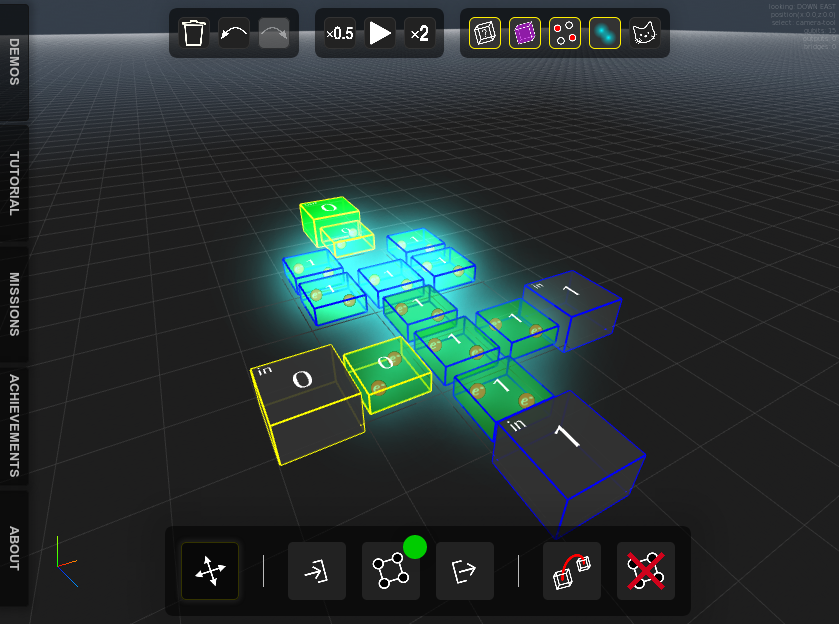

# Quantum Cellular Automata Simulator

> Physics simulation with Quantum Cellular Automata or Q-Dots



In this project we aim to simulate and showcase how Quantum Cellular Automata works, and what can be done with them.
Created by 4 students at IMAC.

## Installing / Getting started

To start QCA Simulator, download the [archive](archive/PROD.zip), and run in a terminal:

```shell
npm install
npm run serve
```

A web browser windows will open with the QCA simulation running. If it doesn't, navigate to http://127.0.0.1:8080/.

## Features

* Simulates Quantum Cellular Automata Circuits
* Supports three-dimensionnal (3D) circuits and quantum entanglement
* Includes a tutorial, demos and missions to learn Quantum Cellular Automata
* Works on computers, tablets and mobile phones
* Has cats
